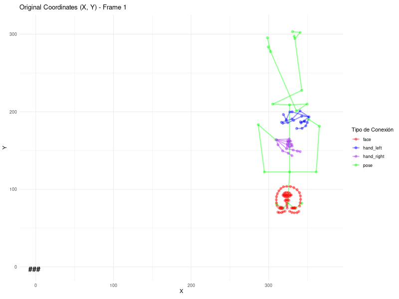
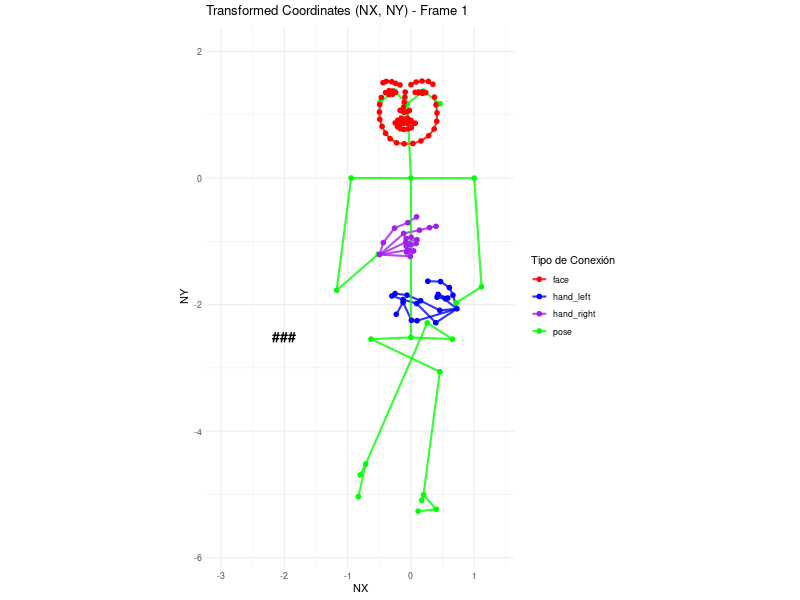
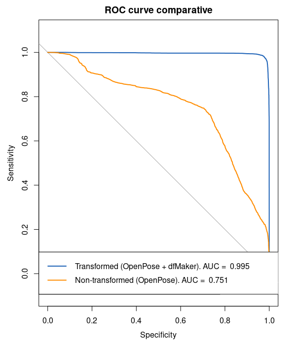

- [Overview](#overview)
  - [Installation Guide](#installation-guide)
    - [Step 1: Installing R](#step-1-installing-r)
    - [Step 2: Installing RStudio (Optional)](#step-2-installing-rstudio-optional)
    - [Step 3: Running `dfMaker`](#step-3-running-dfmaker)
- [Usage](#usage)
  - [Basic Usage](#basic-usage)
  - [Saving to a Specific File](#saving-to-a-specific-file)
  - [In-memory Processing Without Saving](#in-memory-processing-without-saving)
  - [Specifying Output Path](#specifying-output-path)
- [Parameters](#parameters)
- [Configuration File Structure](#configuration-file-structure)
- [Functionality](#functionality)
- [Output](#output)
- [Algebraic Definition of Matrix](#algebraic-definition-of-matrix)
- [Coordinate Transformation and Y-Axis Inversion](#coordinate-transformation-and-y-axis-inversion)
  - [Axial Reflection](#axial-reflection)
  - [Applying Cramer's Rule for Coordinate Transformation](#applying-cramers-rule-for-coordinate-transformation) 
- [ROC Curve Comparative Test for Wrist Coordinate Classification](#roc-curve-comparative-test-for-wrist-coordinate-classification)
- [Collaboration and Contributions](#collaboration-and-contributions)
  - [Reporting Issues or Asking Questions](#reporting-issues-or-asking-questions)


---

# `dfMaker` Function Documentation for OpenPose Data Processing

## Overview

The `dfMaker` function is a comprehensive tool designed for processing and organizing keypoints data generated by [OpenPose](https://github.com/CMU-Perceptual-Computing-Lab/openpose), a cutting-edge tool for real-time multi-person system to detect human body, hand, facial, and foot keypoints. This documentation details the function's usage, input parameters, the configuration file structure, and the algebraic definition of the data structure used for keypoints representation.


To integrate `dfMaker` into your workflow, it's now part of the `multimolang` package, which streamlines multimodal data analysis in linguistic research. Here's how to install and use it:

**Installation Steps:**

1. **Install the `multimolang` Package:**

   - Open your R console and execute:
   
     ```r
     install.packages("multimolang")
     ```
   - This command installs `multimolang` from CRAN, including the `dfMaker` function.

2. **Load the `multimolang` Package:**

   - After installation, load the package with:
   
     ```r
     library(multimolang)
     ```

**Using `dfMaker`:**

The `dfMaker` function processes OpenPose JSON files into structured data frames. Here's how to use it:

1. **Prepare Your Data:**

   - Ensure your OpenPose JSON files are organized in a single directory.

2. **Run `dfMaker`:**

   - Specify the directory containing your JSON files:
   
     ```r
     df <- dfMaker(input.folder = "path/to/your/JSON/files")
     ```
     
   - This command processes the JSON files and returns a data frame with the structured data.

**Additional Information:**

- **Dependencies:** `dfMaker` utilizes the `arrow` package for efficient data handling. If not already installed, you can add it using:
  
```r
  install.packages("arrow")
  ```

- **Documentation:** For detailed information and advanced usage, refer to the [multimolang package documentation](https://cran.r-project.org/package=multimolang).


## Usage


Below are several examples demonstrating different use cases:

### Basic Usage

Automatically process OpenPose JSON files and save the output with an auto-generated name based on unique IDs:

```r
dfMaker(input.folder = "./path/to/input")
```

### Saving to a Specific File

Process data and explicitly save it as a Parquet file:

```r
dfMaker(input.folder = "./path/to/input",
        output.file = "./path/to/outputs/processed_data.parquet")
```

For CSV output:

```r
dfMaker(input.folder = "./path/to/input",
        output.file = "./path/to/outputs/processed_data.csv")
```

### In-memory Processing Without Saving

Process files for in-memory use without saving to disk:

```r
example <- dfMaker(input.folder = "./path/to/input",
                   no_save = TRUE)
```

### Specifying Output Path

Define an output path for saving the processed file with an automatically generated name:

```r
dfMaker(input.folder = "./path/to/input",
        output.path = "./path/to/custom_output/")
```


### Parameters

- `input.folder`: The directory containing JSON files output by OpenPose. Each file should represent keypoints data for a single frame of video.
- `config.path`: Optional. The path to a JSON configuration file specifying which metadata fields to extract and include in the output. If not provided, default settings are used.
- `output.file`: Optional. Specifies the path and filename for the output file. If provided, the function writes the processed data to this file in either CSV or Parquet format, determined by the file extension. If not provided or empty, and multiple unique IDs are not found, the function automatically names the file based on the unique ID from the OpenPose data.
- `output.path`: Optional. Specifies the directory where the output file will be saved. If `output.file` is not provided or is empty, and there's exactly one unique ID in the processed data, the function automatically creates an output file named after the unique ID within this directory. If `output.path` is not specified, the function will create a default directory `./df_outputs/` to save the output file. This ensures organized storage of output files, especially useful when processing multiple datasets or running batch processes.

### Configuration File Structure

The configuration file is a JSON document that allows users to specify additional metadata to extract from the file names or directory structure. The structure of the configuration file is as follows:

```json
{
  "extract_datetime": false,
  "extract_time": false,
  "extract_exp_search": false,
  "extract_country_code": false,
  "extract_network_code": false,
  "extract_program_name": false,
  "extract_time_range": false,
  "timezone": "America/Los_Angeles"
}
```

Each field in the configuration file is a boolean that indicates whether the corresponding piece of metadata should be extracted. The `timezone` field specifies the timezone for datetime conversion.

## Functionality

`dfMaker` performs the following operations:
- Reads JSON files from `input.folder`, each representing keypoints data for individual frames produced by OpenPose.
- Processes each file according to the configurations specified in `config.path` (if provided).
- Constructs $M_{i,j}$ matrices for each detected person and point type, organizing keypoints data into a structured format.
- Optionally extracts additional metadata based on file names and the specified configuration.
- Combines all processed data into a single dataframe.
- Outputs the consolidated data to `output.file` in the specified format (CSV or Parquet), automatically naming the file based on unique IDs if required.

## Output

The function returns a dataframe in R, containing the combined keypoints data from all processed frames, along with any extracted metadata. If `output.file` is specified, it also writes this data to a file in the chosen format.

This tool facilitates the detailed analysis of human poses, movements, and interactions, supporting research and development in areas such as motion analysis, computer vision, and interactive systems.


## Algebraic Definition of Matrix

The $M_{i,j}$ matrix is an organized representation of the keypoints data processed by OpenPose. This structured matrix format simplifies the handling and analysis of keypoints data by organizing it into rows and columns, where each row corresponds to a keypoint and each column represents one of the three attributes: x-coordinate, y-coordinate, and the confidence score. Here's the structured representation of the matrix:

$$
M_{i,j} =
  \begin{bmatrix}
K_{1,x} & K_{1,y} & K_{1,c} \\
K_{2,x} & K_{2,y} & K_{2,c} \\
\vdots & \vdots & \vdots \\
K_{N,x} & K_{N,y} & K_{N,c}
\end{bmatrix}
$$

In this matrix:

- $K$ represents any keypoint.

- $N$ represents the $N$-th keypoint.

- $j$ (the column index) indicates which variable (x, y, c) is being described.

This format ensures that each keypoint’s positional and confidence data is systematically organized and easily accessible for further processing and analysis.


## Coordinate Transformation and Y-Axis Inversion

This section explains the process of normalizing keypoints coordinates obtained from computer vision software, ensuring the data aligns with a mathematical coordinate system. Given the nature of computer vision data, where the origin often differs from traditional Cartesian systems, we introduce a method to normalize and adjust the orientation of keypoints data.


### Axial Reflection

As we observed in the below figure, the original coordinates from `OpenPose` are positioned in a Cartesian quadrant, specifically the first quadrant where all values are positive. Additionally, since the origin of coordinates is fixed at the top-left corner, the values increase as we move down the image. This poses a challenge in interpreting the data, which can make it difficult, if not impossible, to conceive complex models for Human Pose Estimation (HPE).


| Original | Transformed |
|----------|-------------|
|  |  |

For this reason, it is necessary to obtain a coherent coordinate system that allows us to interpret the human pose in a more intuitive way. A simple reflection, which is even simpler in two dimensions, allows us to present our HPE data effectively for modeling with minimal computational cost.

To perform a reflection, we only need to multiply the *key points* ($P_k(x_i,y_j)$) by the identity matrix, where the sign for the 'y' axis vector is changed. Instead of the second column of the identity matrix defining the unit of the 'y' axis as (0,1), it is (0,-1). This sign change automatically inverts the axis without the need for further mathematical operations.

$$
I_{x,y} = \begin{bmatrix}
1 & 0 \\
0 & -1 
\end{bmatrix}
$$

Given a point $P(a,b)$, to reflect it over the 'x' axis, we multiply $P$ by $I_{x,y}$:

$$
P' = P \cdot I_{x,y} = \begin{bmatrix} a & b \end{bmatrix} \cdot \begin{bmatrix} 1 & 0 \\ 0 & -1 \end{bmatrix} = \begin{bmatrix} a & -b \end{bmatrix}
$$


### Applying Cramer's Rule for Coordinate Transformation

Cramer's Rule offers a systematic way to solve systems of linear equations that arise during the normalization and transformation of keypoints coordinates from computer vision outputs. This method is particularly useful for calculating the transformation matrix coefficients when we need to adjust the coordinate system based on keypoints, such as normalizing distances or inverting axes. It is a theorem in linear algebra that provides the solution to a system of linear equations with as many equations as unknowns, given that the system's matrix determinant is non-zero. This makes it especially handy for calculating transformations involving scaling and rotation where the equations are linear.


To apply Cramer's Rule for our purpose of coordinate normalization and Y-axis inversion, consider a system where the transformations are linear and can be represented by equations relating original keypoints to their transformed counterparts. For a transformation involving normalization based on the distance between specific keypoints (like the chest and shoulder) and inversion of the Y-axis, the system of equations can be represented as follows:


To begin, we need to define our transformation matrix for the new coordinate system. In the generic case of `dfMaker`, the left shoulder point, identified as point 5 in the `pose_keypoints` ($P_{5}^{pose}$), is chosen to define the unit. Additionally, we need to consider the reflection of the 'y' axis over the 'x' axis.

Once the transformation matrix is defined, we only need to multiply each point in the frame ($P_k(x_i,y_j)$) by this matrix. This multiplication allows us to obtain the equivalent point in our new coordinate system.


## Integration with Computer Vision Data

When working with keypoints data from computer vision software like OpenPose, this approach allows for precise adjustment of the coordinate system to fit analytical or visualization needs. By applying transformations derived through Cramer's Rule, data scientists and researchers can ensure that their keypoints data is properly scaled and oriented, facilitating more accurate analysis and interpretation of human poses and movements.


## ROC Curve Comparative Test for Wrist Coordinate Classification

### Objective
The ROC Curve Comparative Test aims to evaluate the performance of a logistic regression model in classifying wrist coordinates as either left or right wrist positions, based on keypoints from `pose_keypoints` where point 7 corresponds to the left wrist and point 4 to the right wrist. The model is tested using both transformed (nx, ny) and non-transformed (x, y) coordinates extracted from 381 videos. **Each video features a single individual facing the camera, providing a controlled setting for accurate pose analysis.**

### Methodology
The test involves a logistic regression model built within the R programming environment, following this procedure:

1. **Data Preparation**: Splitting the dataset into training and test subsets.
2. **Data Transformation**: Applying a transformation to one set of coordinates while leaving the other set as original.
3. **Model Training**: Training the logistic regression model on both sets of data separately to assess the impact of the transformation.
4. **Prediction and Performance Evaluation**: Generating predictions for both datasets and evaluating them using the ROC curve and Area Under Curve (AUC) metrics.

### Test Code Example

```R
# Load necessary packages
library(caret)
library(pROC)

# Prepare the data
set.seed(123)
partition <- createDataPartition(y = filtered_data$points, p = 0.7, list = FALSE)
training_data <- filtered_data[partition, ]
test_data <- filtered_data[-partition, ]

# Apply transformation to one set of coordinates
# Assuming transformation details are provided earlier or elsewhere in the documentation

# Train the model for transformed coordinates
probabilities_transformed <- predict(model, newdata = test_data[c('nx', 'ny')], type = "response")

# Train the model for non-transformed coordinates
probabilities_non_transformed <- predict(model, newdata = test_data[c('x', 'y')], type = "response")

# Generate ROC curves
roc_transformed <- roc(test_data$points, probabilities_transformed)
roc_non_transformed <- roc(test_data$points, probabilities_non_transformed)

# Plot ROC curves
plot(roc_transformed, col = "#1c61b6")
plot(roc_non_transformed, col = "#ff8c00", add = TRUE)
legend("bottomleft", legend = c(paste("Transformed. AUC = ", round(roc_transformed$auc, 3)),
                                 paste("Non-transformed. AUC = ", round(roc_non_transformed$auc, 3))),
       col = c("#1c61b6", "#ff8c00"), lwd = 2)
```

### Results



Using transformed data (blue line), the model achieved an AUC of 0.995, indicating near-perfect classification ability. Conversely, using original data (orange line), the model recorded a lower AUC of 0.751, suggesting lower accuracy. This highlights the significant impact of data transformation on the model's predictive performance.

### Conclusion
Data transformation significantly improves the logistic regression model's predictive accuracy, particularly when classifying wrist positions in a structured setting where only one individual is present per video, and they are directly facing the camera. This test is a vital component of our ongoing efforts to refine data processing techniques for enhanced predictive performance in pose analysis.


## Collaboration and Contributions

Contributions to improve `dfMaker` or extend its functionalities are welcome. To contribute:

1. Fork the repository.
2. Clone your fork and create a new branch for your feature or fix.
3. Make changes and test.
4. Submit a pull request with a comprehensive description of changes.
5. Any technical question: brian.herreno@um.es ;)

### Reporting Issues or Asking Questions

Encounter an issue or have questions? Check the documentation first. If unresolved, open an issue in the repository or reach out to the maintainers directly if contact information is provided.
